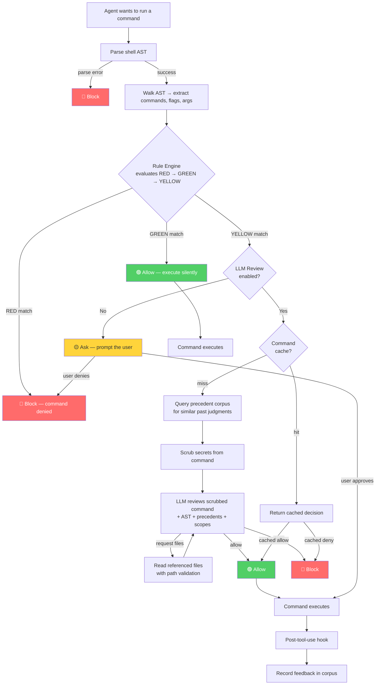

# Stargate

A bash command classifier for AI coding agents. Stargate sits between an AI coding agent and shell execution, parsing commands into ASTs, evaluating them against configurable rules, and escalating ambiguous commands to an LLM for review.

## How It Works

When an AI coding agent (like Claude Code) tries to run a shell command, Stargate intercepts it via a pre-tool-use hook and classifies it before execution:



### Classification Levels

- **🔴 RED** — Hard block. Destructive commands (`rm -rf /`), privilege escalation (`sudo`), data exfiltration tools (`nc`, `socat`). No override, no LLM review. Blocked instantly.
- **🟢 GREEN** — Safe to execute. Read-only commands (`ls`, `git status`, `cat`), trusted toolchains (`go build`, `cargo test`), and scope-matched operations (e.g., `curl` to a domain in your trusted `allowed_domains` list).
- **🟡 YELLOW** — Ambiguous. Could be safe or dangerous depending on context. Three paths:
  - **No LLM configured**: the user is prompted to approve or deny every time.
  - **LLM configured but `llm_review = false`**: same as above — user prompt, no LLM call.
  - **LLM configured + `llm_review = true`**: the command is scrubbed (secrets in env assignments and token patterns redacted), then an LLM (Claude) reviews it with full context — a structured AST summary, the scrubbed command, the operator's scope definitions, and similar past judgments from the precedent corpus. If `allow_file_retrieval` is enabled, the LLM can also request to inspect files referenced in the command (validated against `allowed_paths`/`denied_paths`) before rendering a final verdict.

### The Precedent Corpus

Stargate maintains a SQLite database of past classification decisions. When a new YELLOW command enters LLM review, similar past judgments are injected into the prompt as precedents. This gives the LLM consistency — if it allowed `curl -s https://api.example.com` yesterday, it sees that context today.

Similarity matching in the corpus is based on argument-agnostic structural signatures (command name + subcommand + flags + context), so `curl -s https://foo.com` and `curl -s https://bar.com` are recognized as the same pattern, while `git status` and `git push` are not. For debugging and auditing, Stargate also stores a scrubbed version of the raw command (with secrets redacted).

### Feedback Loop

When a YELLOW command executes (either user-approved or LLM-approved), the post-tool-use hook reports the outcome back to Stargate. The execution is recorded as `user_approved` in the corpus, building a richer precedent base over time. GREEN commands execute without feedback — they don't generate corpus entries. The LLM sees prior approved executions as context but is not bound by them; it can still deny a command if the current invocation differs materially.

### Scope-Based Trust

Rules can be bound to operator-defined scopes. For example, `curl` is GREEN when the target domain is in your `allowed_domains` list, but YELLOW (with LLM review) when it's not. Scopes live in `stargate.toml` — outside any repo — so they can't be manipulated by repo contents or prompt injection.

## Quick Start

### 1. Install

```bash
go install github.com/limbic-systems/stargate/cmd/stargate@latest
```

Or build from source:

```bash
git clone https://github.com/limbic-systems/stargate.git
cd stargate
just build
just install
```

### 2. Initialize

```bash
stargate init
```

This creates `~/.config/stargate/stargate.toml` with a comprehensive default rule set (30 RED, 36 YELLOW, 17 GREEN rules) and the corpus directory. Edit the config to customize scopes and rules for your environment.

> **Security:** `stargate.toml` MUST live outside any repository that stargate guards. A config inside a repo is writable by repo contents and therefore untrusted. The default path `~/.config/stargate/stargate.toml` is outside all repos.

### 3. Start the server

```bash
stargate serve
```

### 4. Configure Claude Code

Add to your Claude Code hooks configuration (`.claude/settings.json`):

```json
{
  "hooks": {
    "PreToolUse": [
      {
        "matcher": "Bash",
        "hooks": [
          {
            "type": "command",
            "command": "stargate hook --agent claude-code --event pre-tool-use"
          }
        ]
      }
    ],
    "PostToolUse": [
      {
        "matcher": "Bash",
        "hooks": [
          {
            "type": "command",
            "command": "stargate hook --agent claude-code --event post-tool-use"
          }
        ]
      }
    ]
  }
}
```

## CLI Reference

| Subcommand | Description |
|-----------|-------------|
| `stargate init` | Set up the stargate environment (config, directories) |
| `stargate serve` | Start the HTTP classification server |
| `stargate hook` | Run as a Claude Code hook adapter (reads JSON from stdin) |
| `stargate test <command>` | Dry-run classify a command for debugging |
| `stargate config validate` | Validate the config file |
| `stargate config dump` | Print the effective config as TOML |
| `stargate config rules` | Print a summary of loaded rules |
| `stargate corpus stats` | Print corpus statistics |

Run `stargate <subcommand> --help` for detailed flags.

## Environment Variables

### LLM Authentication

Set **one** of these to enable LLM review for YELLOW commands. If neither is set, LLM review is disabled and all YELLOW commands prompt the user directly.

| Variable | How it works | Tradeoffs |
|----------|-------------|-----------|
| `ANTHROPIC_API_KEY` | Direct API calls via the Anthropic SDK. | **Faster** (~3-4s per review). Requires a paid API key from [console.anthropic.com](https://console.anthropic.com). You control the billing account and rate limits. |
| `CLAUDE_CODE_OAUTH_TOKEN` | Subprocess calls via `claude -p`. Requires the `claude` CLI on PATH. | **Slower** (~10-12s per review) but uses your existing Claude Code authentication — no separate API key needed. |

Do not set both. If both are set, `ANTHROPIC_API_KEY` takes precedence.

```bash
# Option 1: Direct API key (recommended for production)
export ANTHROPIC_API_KEY="sk-ant-..."

# Option 2: Use Claude Code's OAuth token (convenient for development)
export CLAUDE_CODE_OAUTH_TOKEN="sk-ant-oat01-..."
```

### Other Variables

| Variable | Default | Purpose |
|----------|---------|---------|
| `STARGATE_CONFIG` | `~/.config/stargate/stargate.toml` | Override the config file path. |
| `STARGATE_URL` | `http://127.0.0.1:9099` | Override the server URL for `stargate hook`. |

## Security Notes

- **Trust anchor:** `stargate.toml` must live outside any repository that stargate guards. The config is the root trust anchor — it defines what commands are safe, dangerous, or ambiguous. A config inside a repo could be modified by repo contents or prompt injection.

- **Fail-closed:** If the stargate server is unreachable, the hook exits with code 2 (blocking error in Claude Code). Commands are NOT silently allowed when the server is down.

- **`config dump` sensitivity:** Password fields are scrubbed in `config dump` output, but other values (LLM system prompts, scrubbing patterns) appear as-is. Use environment variables for credentials rather than embedding them in the TOML file.

- **Localhost only:** The server binds to `127.0.0.1` only. Non-loopback bind addresses are rejected by both the config validator and the `--listen` flag. The `--allow-remote` flag on `stargate hook` controls the *hook client* connecting to a remote server, not the server bind address.

## Development

Requires [Go](https://go.dev/) 1.26+ and [just](https://github.com/casey/just).

```bash
just test        # Run all tests with race detector
just vet         # Run go vet
just vuln        # Run govulncheck for known vulnerabilities
just build       # Build for local platform
just build-all   # Cross-compile for linux/darwin × amd64/arm64
just checksums   # Generate SHA256SUMS for release binaries
just clean       # Remove build artifacts
```

## License

[Apache-2.0](LICENSE)
